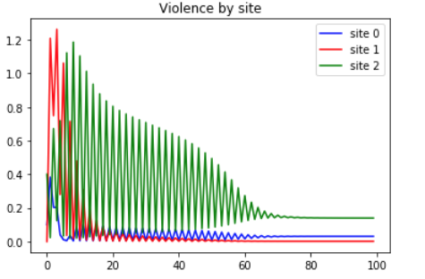

# UCLA_2019_REU
## Python code for dynamic model used to study patterns of violence in Los Angeles during 2019 REU in applied mathematics at UCLA.

An attempt to model the interplay between police presence in high crime areas, and the destablization of neighboring sites.

||
|:--:| 
||
